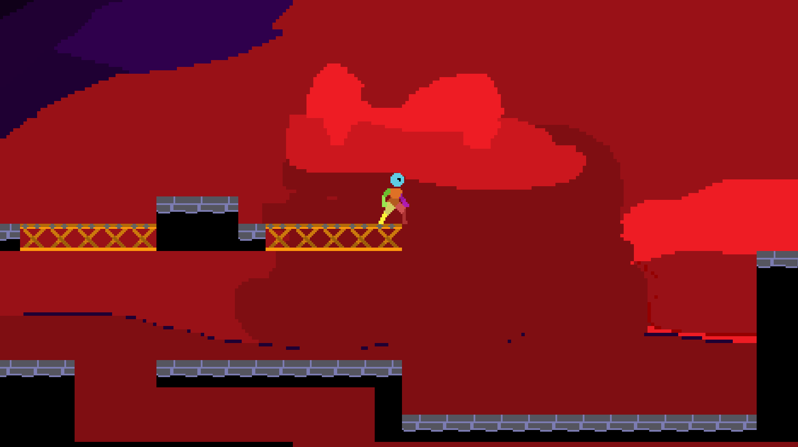

# Game Maker Platformer

## Description

I'm making a platformer using a starter project my Dad created for GameMaker. 

Check out the [starter project](https://github.com/deanblackborough/gm-platformer) to start creating your own game and extend all the game objects as I have done.

## Current Progress

## Controls

Check the `player/scripts/playerInput` script file, the controls should be what you expect though.

